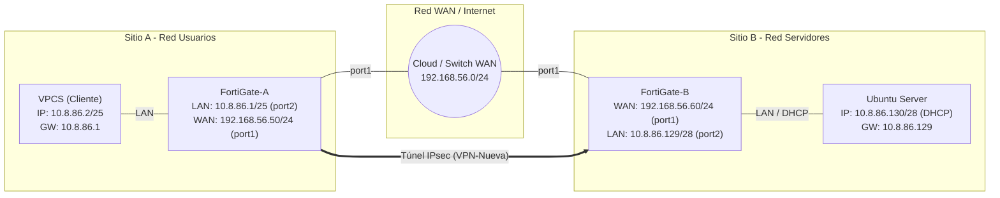

# Laboratorio de Seguridad de Redes: VPN IPsec Site-to-Site entre FortiGates (FortiOS) TOPOLOGIA 1

**Autor:** Jaymel Feliz
**Matrícula:** 20240886
**Plataforma de Virtualización:** GNS3
**Enlace al Video Demostrativo:** https://youtu.be/UWkg2iqNfSg

---

## Tabla de Contenido
1. [Propósito del Laboratorio](#1-propósito-del-laboratorio)
2. [Topología de Red](#2-topología-de-red)
3. [Tabla de Direccionamiento](#3-tabla-de-direccionamiento)
4. [Funcionamiento de la Configuración](#4-funcionamiento-de-la-configuración)
5. [Configuraciones Implementadas Paso a Paso](#5-configuraciones-implementadas-paso-a-paso)
6. [Políticas de Seguridad y Enrutamiento](#6-políticas-de-seguridad-y-enrutamiento)
7. [Validación, Diagnóstico y Pruebas de Aislamiento](#7-validación-diagnóstico-y-pruebas-de-aislamiento)
8. [Diagramas y Evidencias](#8-diagramas-y-evidencias)
9. [Running Configurations Completo](#9-running-configurations-completo)
10. [Scripts y Archivos Utilizados](#10-scripts-y-archivos-utilizados)
11. [Conclusión](#11-conclusión)

---

## 1. Propósito del Laboratorio
El objetivo principal de esta práctica es diseñar, implementar, auditar y diagnosticar un túnel **Site-to-Site IPsec VPN (IKEv2)** utilizando dos cortafuegos **FortiGate (FortiOS)** en un entorno de simulación GNS3. El laboratorio busca interconectar de forma segura la red de **Usuarios (Sitio A: `10.8.86.0/25`)** con la red de **Servidores (Sitio B: `10.8.86.128/28`)** a través de una red WAN no segura (`192.168.56.0/24`), garantizando confidencialidad, integridad y autenticidad del tráfico mediante algoritmos criptográficos robustos.


---

## 2. Topología de Red
La arquitectura consta de tres zonas principales:
* **Sitio A (Red Usuarios):** Un equipo cliente (VPCS) conectado a la interfaz LAN (`port2`) de **FortiGate-A**.
* 

* **Red WAN / Internet:** Segmento no seguro (`192.168.56.0/24`) que conecta la interfaz `port1` de ambos cortafuegos.
* 

* **Sitio B (Red Servidores):** Un servidor Ubuntu conectado a la interfaz LAN (`port2`) de **FortiGate-B**, configurado dinámicamente mediante el servidor **DHCP** de este último.
* 




---

## 3. Tabla de Direccionamiento
El esquema IP fue diseñado de manera jerárquica utilizando los últimos dígitos de la matrícula asignada (**20240886**).

| Dispositivo / Zona | Interfaz | Dirección IP / Máscara | Gateway | Rol / Descripción |
| :--- | :--- | :--- | :--- | :--- |
| **VPCS (Cliente)** | `eth0` | `10.8.86.2/25` | `10.8.86.1` | Cliente en Sitio A (Configuración Manual) |
| **FortiGate-A** | `port2` (LAN) | `10.8.86.1/25` | N/A | Gateway Red Usuarios |
| **FortiGate-A** | `port1` (WAN) | `192.168.56.50/24` | `192.168.56.1` | IP Pública Gateway A |
| **FortiGate-B** | `port1` (WAN) | `192.168.56.60/24` | `192.168.56.1` | IP Pública Gateway B |
| **FortiGate-B** | `port2` (LAN) | `10.8.86.129/28` | N/A | Gateway Red Servidores + Servidor DHCP |
| **Ubuntu Server** | `eth0` | `10.8.86.130/28` | `10.8.86.129` | Servidor de Destino (Cliente DHCP) |

---

## 4. Funcionamiento de la Configuración
1. **Fase IKEv2 y Cifrado:** Ambos FortiGates negocian una asociación de seguridad (SA) mediante **IKEv2** utilizando la clave precompartida `Secreta123` y la propuesta criptográfica `AES128-SHA256` con Diffie-Hellman Group `14`.
2. **Selectores de Fase 2:**
   * **Sitio A:** Local `10.8.86.0/25` $
ightarrow$ Remote `10.8.86.128/28`.
   * **Sitio B:** Local `10.8.86.128/28` $
ightarrow$ Remote `10.8.86.0/25`.
3. **Enrutamiento Estático:** Cada firewall dirige el tráfico de la red privada opuesta hacia la interfaz virtual `VPN-Nueva`.
4. **Bypass de NAT:** Las políticas de firewall permiten el flujo bidireccional manteniendo el **NAT desactivado**, preservando las cabeceras IP originales para que coincidan con los selectores del túnel.

---

## 5. Configuraciones Implementadas Paso a Paso

### Paso 1: Configuración de Red e Interfaces Básico

#### **FortiGate-A (Sitio A)**
1. **Interfaz LAN (`port2`):**
   * Configurada en modo estático con la IP `10.8.86.1/25` (`255.255.255.128`).
   * Ping habilitado para pruebas de conectividad local.
2. **Interfaz WAN (`port1`):**
   * Configurada con la IP estática pública `192.168.56.50/24` (`255.255.255.0`).
   * Habilitados accesos administrativos (`ping`, `https`, `ssh`).
3. **Cliente VPCS (Sitio A):**
   * Configurado manualmente en el puerto LAN con la IP `10.8.86.2/25` y Gateway `10.8.86.1`.

#### **FortiGate-B (Sitio B)**
1. **Interfaz WAN (`port1`):**
   * Configurada con la IP estática pública `192.168.56.60/24` (`255.255.255.0`).
2. **Interfaz LAN (`port2`):**
   * Configurada en modo estático con la IP `10.8.86.129/28` (`255.255.255.240`).
3. **Servidor DHCP en `port2`:**
   * Activado para la red local de Servidores.
   * Rango asignado: `10.8.86.130` - `10.8.86.142`.
   * Máscara: `/28` (`255.255.255.240`).
   * Puerta de enlace predeterminada (*Default Gateway*): `10.8.86.129`.

---

### Paso 2: Configuración del Túnel VPN IPsec (Site-to-Site)

La negociación se estableció usando **IKEv2** con parámetros simétricos en ambos extremos:

* **Nombre del Túnel:** `VPN-Nueva`
* **Autenticación:** Pre-Shared Key (`Secreta123`)
* **Propuestas Criptográficas (Fase 1 y Fase 2):** `AES128-SHA256`
* **Grupo Diffie-Hellman:** Group 14

#### **Selectores de Fase 2 (Subredes Interesantes):**
* **En FortiGate-A:**
  * Subred Local: `10.8.86.0/25`
  * Subred Remota: `10.8.86.128/28`
* **En FortiGate-B:**
  * Subred Local: `10.8.86.128/28`
  * Subred Remota: `10.8.86.0/25`

---

### Paso 3: Enrutamiento Estático

Para indicar a cada FortiGate cómo llegar a la subred privada del extremo opuesto a través del túnel:

1. **Ruta en FortiGate-A:**
   * **Destino:** `10.8.86.128/28`
   * **Interfaz de salida:** Interfaz virtual `VPN-Nueva`.
2. **Ruta en FortiGate-B:**
   * **Destino:** `10.8.86.0/25`
   * **Interfaz de salida:** Interfaz virtual `VPN-Nueva`.

---

## 6. Políticas de Seguridad y Enrutamiento

En ambos FortiGates creamos **dos reglas de firewall** bidireccionales para permitir el paso del tráfico y garantizar que el **NAT estuviera desactivado**, evitando que se alteren las IPs de origen al empaquetarse en el túnel IPsec:

1. **Regla de Salida (LAN a VPN):**
   * **Incoming:** `port2` (LAN)
   * **Outgoing:** `VPN-Nueva`
   * **Source / Destination:** `all` / `all`
   * **NAT:** **DESACTIVADO**
2. **Regla de Entrada (VPN a LAN):**
   * **Incoming:** `VPN-Nueva`
   * **Outgoing:** `port2` (LAN)
   * **Source / Destination:** `all` / `all`
   * **NAT:** **DESACTIVADO**

---

## 7. Validación, Diagnóstico y Pruebas de Aislamiento

### Paso 5 del Laboratorio: Ajustes y Correcciones en el Servidor Ubuntu (Sitio B)
Durante las pruebas iniciales identificamos que el tráfico salía cifrado desde el Sitio A pero el servidor no respondía. Realizamos los siguientes tres pasos esenciales en Ubuntu:

1. **Liberación y Renovación de IP por DHCP:**
   * Forzamos la solicitud DHCP con `dhclient eth0` para obtener automáticamente la IP `10.8.86.130/28`.
2. **Ruta por Defecto (*Default Gateway*):**
   * Confirmamos la ruta predeterminada con `ip route`, garantizando la línea:
     `default via 10.8.86.129 dev eth0`
     *(Esta ruta de regreso era imprescindible para que el servidor supiera por dónde responder el ping de vuelta al VPCS).*
3. **Ajuste del Firewall Local (UFW):**
   * Desactivamos el cortafuegos interno de Linux con `sudo ufw disable` para evitar bloqueos y respuestas de tipo `Destination port unreachable` durante los diagnósticos ICMP/UDP.

---

### Paso 6 del Laboratorio: Comandos CLI de Diagnóstico y Pruebas

#### 1. Verificación del Túnel IPsec (CLI)
* **Estado de la Fase 1 (IKE SA):**
  ```bash
  diagnose vpn ike gateway list name VPN-Nueva
  ```
  

  *(Muestra la negociación IKEv2 en estado `established`, las IPs públicas de origen/destino y los algoritmos criptográficos acordados).*

* **Estado de la Fase 2 (IPsec SA / Tráfico Cifrado):**
  ```bash
  diagnose vpn tunnel list name VPN-Nueva
  ```
  *(Muestra las subredes locales/remotas y los contadores `tx pkt` y `rx pkt` incrementándose).*


#### 2. Captura de Paquetes en Tiempo Real (*Sniffer*)
```bash
diagnose sniffer packet any "host 10.8.86.130" 4 10 local
```
* **Resultado:** Confirmación de que el paquete ingresa por `port2 in` y es conmutado directamente hacia la interfaz virtual `VPN-Nueva out`.


#### 3. Verificación de la Tabla de Enrutamiento
```bash
get router info routing-table all
get router info routing-table details 10.8.86.128
```


#### 4. Pruebas de Diagnóstico Forzadas (Con y Sin VPN)
* **Prueba con Origen LAN (Usa el Túnel):**
  ```bash
  execute ping-options source 10.8.86.1
  execute ping 10.8.86.130
  ```
  *Resultado:* **$0\%$ loss** (Éxito total a través de la VPN).


* **Prueba con Origen WAN (Fuera del Túnel):**
  ```bash
  execute ping-options reset
  execute ping 10.8.86.130
  ```
  *Resultado:* **$100\%$ loss** (Demuestra el aislamiento: el tráfico fuera del selector de Fase 2 no puede acceder a la red privada).


#### 5. Verificación en Servidor Ubuntu
```bash
ip a
ip route
sudo ufw status
```

---


## 8. Diagramas y Evidencias

### 8.1 Evidencia: Estado del Túnel IPsec (UP / Verde)
FORTIGATE A:


FORTIGATE B: 


### 8.2 Evidencia: Políticas de Firewall Sin NAT


### 8.3 Evidencia: Captura de Paquetes (Sniffer CLI)


### 8.4 Evidencia: Respuesta ICMP en Cliente


---

## 9. Running Configurations Completo

### Configuración CLI en FortiGate-A
```bash
config system interface
    edit "port1"
        set mode static
        set ip 192.168.56.50 255.255.255.0
        set allowaccess ping https ssh
    next
    edit "port2"
        set mode static
        set ip 10.8.86.1 255.255.255.128
        set allowaccess ping
    next
end

config vpn ipsec phase1-interface
    edit "VPN-Nueva"
        set interface "port1"
        set ike-version 2
        set peertype any
        set net-device disable
        set proposal aes128-sha256
        set remote-gw 192.168.56.60
        set psksecret Secreta123
    next
end

config vpn ipsec phase2-interface
    edit "P2-A"
        set phase1name "VPN-Nueva"
        set proposal aes128-sha256
        set src-subnet 10.8.86.0 255.255.255.128
        set dst-subnet 10.8.86.128 255.255.255.240
    next
end

config router static
    edit 1
        set dst 10.8.86.128 255.255.255.240
        set device "VPN-Nueva"
    next
end

config firewall policy
    edit 1
        set name "LAN_a_VPN"
        set srcintf "port2"
        set dstintf "VPN-Nueva"
        set srcaddr "all"
        set dstaddr "all"
        set action accept
        set schedule "always"
        set service "ALL"
    next
    edit 2
        set name "VPN_a_LAN"
        set srcintf "VPN-Nueva"
        set dstintf "port2"
        set srcaddr "all"
        set dstaddr "all"
        set action accept
        set schedule "always"
        set service "ALL"
    next
end
```

### Configuración CLI en FortiGate-B
```bash
config system interface
    edit "port1"
        set mode static
        set ip 192.168.56.60 255.255.255.0
        set allowaccess ping https ssh
    next
    edit "port2"
        set mode static
        set ip 10.8.86.129 255.255.255.240
        set allowaccess ping
    next
end

config system dhcp server
    edit 1
        set default-gateway 10.8.86.129
        set netmask 255.255.255.240
        set interface "port2"
        config ip-range
            edit 1
                set start-ip 10.8.86.130
                set end-ip 10.8.86.142
            next
        end
    next
end

config vpn ipsec phase1-interface
    edit "VPN-Nueva"
        set interface "port1"
        set ike-version 2
        set peertype any
        set net-device disable
        set proposal aes128-sha256
        set remote-gw 192.168.56.50
        set psksecret Secreta123
    next
end

config vpn ipsec phase2-interface
    edit "P2-B"
        set phase1name "VPN-Nueva"
        set proposal aes128-sha256
        set src-subnet 10.8.86.128 255.255.255.240
        set dst-subnet 10.8.86.0 255.255.255.128
    next
end

config router static
    edit 1
        set dst 10.8.86.0 255.255.255.128
        set device "VPN-Nueva"
    next
end

config firewall policy
    edit 1
        set name "LAN_a_VPN"
        set srcintf "port2"
        set dstintf "VPN-Nueva"
        set srcaddr "all"
        set dstaddr "all"
        set action accept
        set schedule "always"
        set service "ALL"
    next
    edit 2
        set name "VPN_a_LAN"
        set srcintf "VPN-Nueva"
        set dstintf "port2"
        set srcaddr "all"
        set dstaddr "all"
        set action accept
        set schedule "always"
        set service "ALL"
    next
end
```

---

## 10. Scripts y Archivos Utilizados

### Configuración en Servidor Ubuntu (Sitio B)
```bash
# 1. Solicitar IP por DHCP
sudo ip addr flush dev eth0
sudo dhclient eth0

# 2. Comprobar IP y Gateway
ip a
ip route

# 3. Desactivar Firewall UFW para permitir ICMP
sudo ufw disable
```

---

## 11. Conclusión
La implementación exitosa de este laboratorio demuestra la efectividad de los túneles **IPsec Site-to-Site (IKEv2)** para interconectar sedes remotas sobre infraestructuras no seguras. Se comprobó la importancia del enrutamiento de retorno en los hosts finales, la exención de NAT en las políticas de seguridad y la correcta definición de los selectores de Fase 2 para garantizar la integridad y confidencialidad del tráfico privado.
